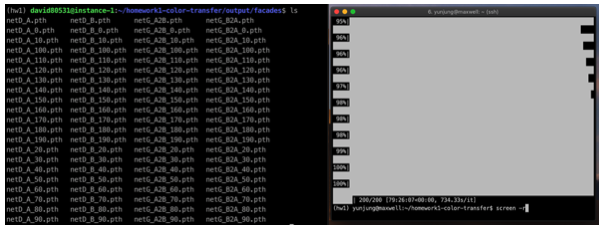
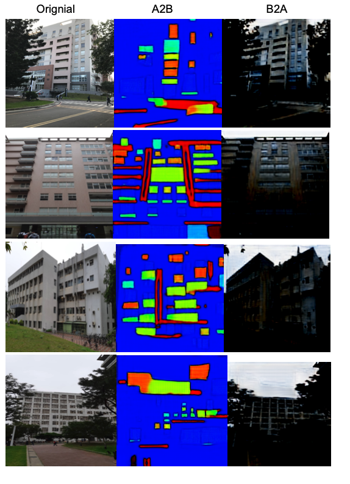
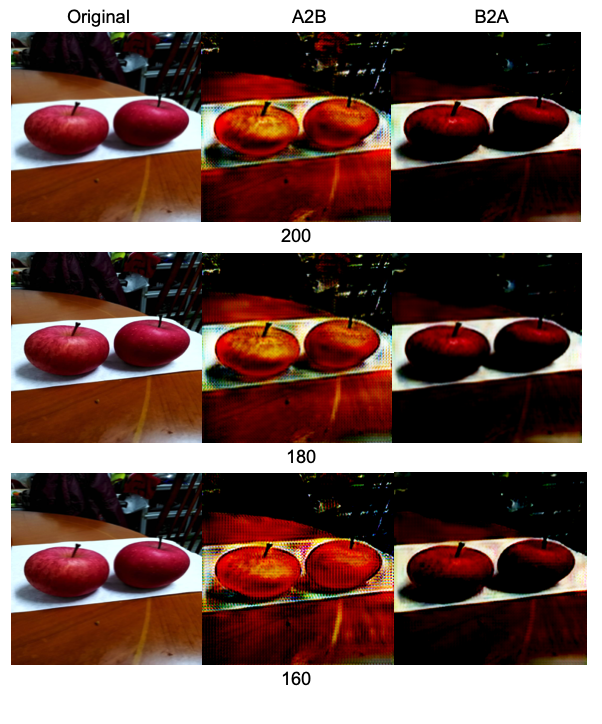
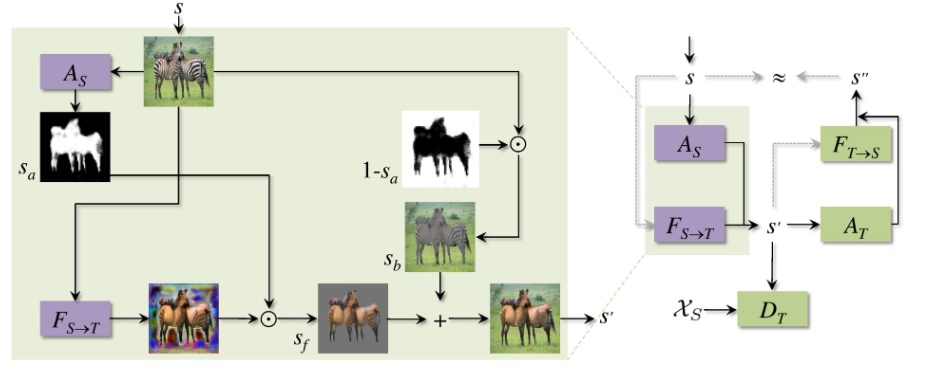
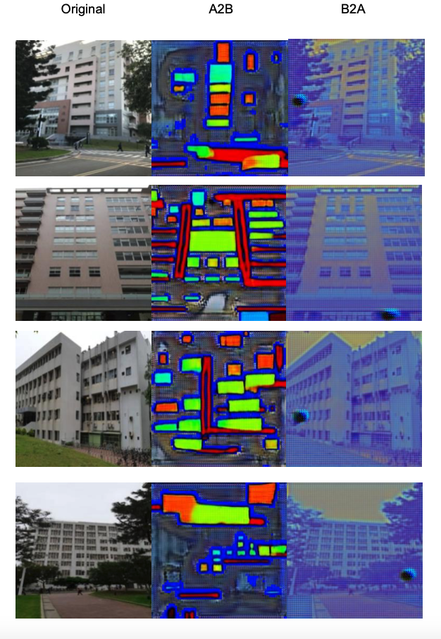

# HW1 Report

## Training CycleGAN

## Inference CycleGAN in personal image
我們train了兩組dataset，facades跟apple2orange。
Inference時，
我們先將原圖resize成256*256的A類圖片，之後轉換成B類圖片，最後再將B轉換回A類圖片觀察最終結果與原圖的差異。(最左邊是原圖A1，中間是B，右邊是A2)
下面是我們在學校裡拍的一些建築物的照片。

* **Facades**  

我們將最後轉出的圖片跟原圖做比較，發現圖片變得比較暗。我們推測是因為我們的有些圖片有大量的背景，像是馬路或是樹木，所以她轉換時有點混淆，導致整體圖片亮度下降。

* **Apple2orange**  

我們也比較了不同epoch數的CycleGan，發現不同epoch數所產生的結果並沒有太大的差異，結果顯示160 epoch跟180 epoch與原本的200 epoch的差異，看起來效果差不多，不過200 epoch的效果似乎好一點。

## Compare with other method
我們跑了另一篇paper

[“Unsupervised Attention-guided Image-to-Image Translation”](https://arxiv.org/pdf/1806.02311.pdf)

這個Model 又稱為Attention Guided GAN

Attention-guidedGAN相較於CycleGAN，額外多一個network訓練找出圖片的feature（也就是我們有興趣轉換的地方）。在CycleGan裡計算兩張圖片的差異是直接考慮整張圖片，然而在
Attention-guidedGAN中，更注重在兩個features之間的差異。也就是說，DomainA的feature部分與DomainB的feature部分差異越小，GAN就會將該圖片對應到DomainB中差異最小的圖片。因此，相較於CycleGAN，Attention-guidedGAN在轉換重要部分時，可以避免將其他不重要部分也跟著轉換，使轉換的效果會比CycleGAN更自然。

以下是我們附的Attention-guidedGAN的流程圖

以下是我們用同樣圖片所跑出來的結果

可以很明顯地看到，這四張圖片與CycleGAN的結果相比，Attention-guidedGAN建築物的部分更加清晰，背景也有被保留下來，但是色調有點偏藍色。不過整體效果看起來更好。

第一列跟第四列與CycleGAN最主要的差別是，CycleGAN的結果會導致馬路與樹木合成一整塊的黑色區域，但是在Attention-guidedGAN裡面，樹木跟馬路都被很好的保存了下來。

由此可見，Attention-guidedGAN 可以比CycleGAN更好的保存圖片的背景部分。
